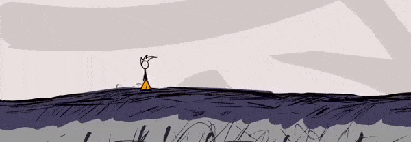

  

<h2 align="center">orvix</h2>

  frontend developer

  building interfaces · exploring full-stack

 

i build things for the web.

currently learning, building and going deeper into
frontend development with a growing interest in backend.

 

### stack

`typescript` · `javascript` · `react` · `node.js`  
`git`

 

### projects

`SferaBank` - a simple, template-based bank page would work well as a layout  

 

  orvix / 2026

